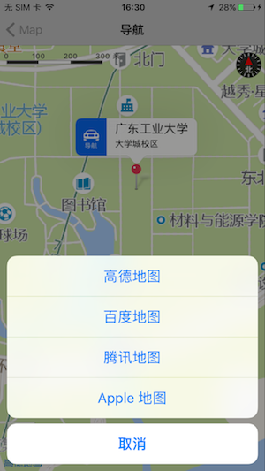

## iOS地图导航

地图导航是iOS应用中常见的一种功能，显示地图中的位置点，点击跳转到相对应的本地地图应用进行导航，如下图所示，常见的本地地图主要有：Apple地图、高德地图、百度地图、腾讯地图，本文主要讲这些地图应用平台是如何进行导航功能接入的，以及在接入过程中遇到的问题，供开发者可以更加便捷地进行开发。



## Contents

- 配置
- 使用
- 类结构

## 配置

**Xcode项目配置**

Info.plist


```
<key>NSLocationAlwaysUsageDescription</key>
	<string>允许开启定位服务</string>
	<key>NSLocationUsageDescription</key>
	<string>App需要您的同意,才能访问位置</string>
	<key>NSLocationWhenInUseUsageDescription</key>
	<string>允许开启定位服务</string>
	<key>LSApplicationQueriesSchemes</key>
	<array>
		<string>iosamap</string>
		<string>baidumap</string>
		<string>qqmap</string>
</array>
```

**框架导入**

使用CocoaPods导入高德地图的2D地图模块

```
# 高德地图，无IDFA
pod 'AMap2DMap-NO-IDFA', '4.6.0'  # 2D地图SDK
```

**高德开放平台的配置**

注册应用的Key，在AppDelegate上进行高德地图的配置

```objective-c
[AMapServices sharedServices].apiKey = @"";
```

## 使用

**示例**

直接使用BMAmapViewController，支持高德和百度坐标系的标注点

```objective-c
MAPointAnnotation *annotation = [[MAPointAnnotation alloc] init];
annotation.coordinate = CLLocationCoordinate2DMake(23.0374, 113.39723);
annotation.title = @"广东工业大学";
annotation.subtitle = @"大学城校区";

BMAmapViewController *amapViewController = [BMAmapViewController new];
amapViewController.title = @"导航";
amapViewController.amapAnnotationArray = @[annotation];
[self.navigationController pushViewController:amapViewController animated:YES];
```

工具类BMMapNavigationTool

```objective-c
+ (void)navigateFrom:(id<MAAnnotation>)fromAnnotation to:(id<MAAnnotation>)toAnnotation;
```

## 类结构

**BMMapNavigationTool**

导航跳转工具类，接入各个平台的跳转代码

```objective-c
/** Apple地图导航 */
+ (void)appleNavigateFrom:(id<MAAnnotation>)fromAnnotation to:(id<MAAnnotation>)toAnnotation {
    MKMapItem *currentLocation =[MKMapItem mapItemForCurrentLocation];
    MKMapItem *toLocation = [[MKMapItem alloc] initWithPlacemark:[[MKPlacemark alloc] initWithCoordinate:toAnnotation.coordinate addressDictionary:nil]];
    toLocation.name = toAnnotation.title;
    
    [MKMapItem openMapsWithItems:@[currentLocation, toLocation] launchOptions:@{MKLaunchOptionsDirectionsModeKey:MKLaunchOptionsDirectionsModeDriving,
                                                                                MKLaunchOptionsShowsTrafficKey:@(YES)}];
}

/** 高德地图导航 */
+ (void)amapNavigateFrom:(id<MAAnnotation>)fromAnnotation to:(id<MAAnnotation>)toAnnotation {
    if (![self canOpenAmap]) return;
    
    CLLocationCoordinate2D fromCoordinate = fromAnnotation.coordinate;
    CLLocationCoordinate2D toCoordinate = toAnnotation.coordinate;
    NSString *applicationName = [self appName];
    NSString *schemeString = [NSString stringWithFormat:@"iosamap://path?sourceApplication=%@&sid=BGVIS1&slat=%f&slon=%f&sname=%@&did=BGVIS2&dlat=%f&dlon=%f&dname=%@&dev=0&t=0", applicationName, fromCoordinate.latitude, fromCoordinate.longitude, fromAnnotation.title, toCoordinate.latitude, toCoordinate.longitude, toAnnotation.title];
    schemeString = [schemeString stringByAddingPercentEscapesUsingEncoding:NSUTF8StringEncoding];
    [self openWithSchemeString:schemeString];
}

+ (BOOL)canOpenAmap {
    NSURL *scheme = [NSURL URLWithString:@"iosamap://"];
    BOOL canOpen = [[UIApplication sharedApplication] canOpenURL:scheme];
    if (!canOpen) {
        NSLog(@"未安装高德地图");
        return NO;
    }
    return YES;
}

/** 百度地图导航 */
+ (void)baiduMapNavigateFrom:(id<MAAnnotation>)fromAnnotation to:(id<MAAnnotation>)toAnnotation {
    if (![self canOpenBaiduMap]) return;
    
    CLLocationCoordinate2D toCoordinate = toAnnotation.coordinate;
    NSString *applicationName = [self appName];
    NSString *schemeString = [NSString stringWithFormat:@"baidumap://map/direction?destination=latlng:%f,%f|name:%@&mode=driving&coord_type=gcj02&src=%@", toCoordinate.latitude, toCoordinate.longitude, toAnnotation.title, applicationName];
    schemeString = [schemeString stringByAddingPercentEscapesUsingEncoding:NSUTF8StringEncoding];
    [self openWithSchemeString:schemeString];
}

+ (BOOL)canOpenBaiduMap {
    NSURL *scheme = [NSURL URLWithString:@"baidumap://"];
    BOOL canOpen = [[UIApplication sharedApplication] canOpenURL:scheme];
    if (!canOpen) {
        NSLog(@"未安装百度地图");
        return NO;
    }
    return YES;
}

/** 腾讯地图导航 */
+ (void)qqMapNavigateFrom:(id<MAAnnotation>)fromAnnotation to:(id<MAAnnotation>)toAnnotation {
    if (![self canOpenQQMap]) return;
    
    CLLocationCoordinate2D fromCoordinate = fromAnnotation.coordinate;
    CLLocationCoordinate2D toCoordinate = toAnnotation.coordinate;
    NSString *applicationName = [self appName];
    NSString *schemeString = [NSString stringWithFormat:@"qqmap://map/routeplan?type=drive&fromcoord=%f,%f&from=%@&tocoord=%f,%f&to=%@&coord_type=2&policy=0&referer=%@", fromCoordinate.latitude, fromCoordinate.longitude, fromAnnotation.title, toCoordinate.latitude, toCoordinate.longitude, toAnnotation.title, applicationName];
    schemeString = [schemeString stringByAddingPercentEscapesUsingEncoding:NSUTF8StringEncoding];
    [self openWithSchemeString:schemeString];
}

+ (BOOL)canOpenQQMap {
    NSURL *scheme = [NSURL URLWithString:@"qqmap://"];
    BOOL canOpen = [[UIApplication sharedApplication] canOpenURL:scheme];
    if (!canOpen) {
        NSLog(@"未安装腾讯地图");
        return NO;
    }
    return YES;
}

+ (void)openWithSchemeString:(NSString *)schemeString {
    NSURL *scheme = [NSURL URLWithString:schemeString];
    if ([[UIDevice currentDevice].systemVersion integerValue] >= 10) {  // iOS10以后,使用新API
        [[UIApplication sharedApplication] openURL:scheme options:@{} completionHandler:^(BOOL success) { NSLog(@"scheme调用结束"); }];
    }
    else {  // iOS10以前,使用旧API
        [[UIApplication sharedApplication] openURL:scheme];
    }
}

+ (NSString *)appName {
    return [NSBundle mainBundle].infoDictionary[@"CFBundleDisplayName"];
}

+ (UIViewController *)currentViewController {
    UIViewController *rootVC = UIApplication.sharedApplication.keyWindow.rootViewController;
    if ([rootVC isKindOfClass:[UINavigationController class]]) {
        UINavigationController *navRootVC = (UINavigationController *)rootVC;
        return navRootVC.viewControllers.lastObject;
    }
    if ([rootVC isKindOfClass:[UITabBarController class]]) {
        UITabBarController *tabBarRootVC = (UITabBarController *)rootVC;
        UIViewController *selectedVC = tabBarRootVC.selectedViewController;
        if ([selectedVC isKindOfClass:[UINavigationController class]]) {
            UINavigationController *navSelectedVC = (UINavigationController *)selectedVC;
            return navSelectedVC.viewControllers.lastObject;
        }
        return selectedVC;
    }
    return rootVC;
}
```

**BMAmapView**

**显示标注点地址的View，可直接集成目标View中**